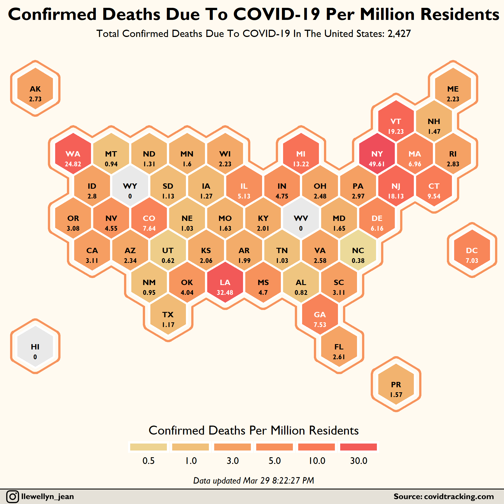

[R code](https://github.com/Henryjean/CovidHexMap/blob/master/covid19_us_hexmap.R) on how to scrape and visualize COVID-19 data

## Author
Owen Phillips ([@llewellyn_jean](https://instagram.com/llewellyn_jean/))

## Special Credits
Philippe Massicotte and his awesome [work](https://github.com/PMassicotte/dataviz/blob/master/R/covid19_us_states.R). 
